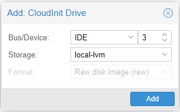
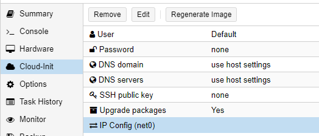
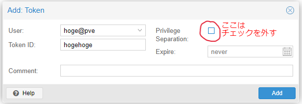
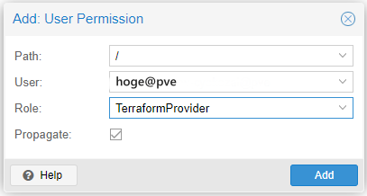

# Terraform × Cloud-InitでVMのセットアップをいい感じにする vol.1

---

## はじめに

### TL;DR

- cloud initはLinuxの初期設定を簡単にするもの
- Proxmox VEをTerraformで楽ちんにする方法をメモしたもの
- Terraform大好き😍chu❤️‍🔥

### [cloud init][cloud-initを使ったLinux OSの初期設定]とは

上記の通りLinux OSのインスタンスの初期設定をいい感じに自動化してくれる優れもの。GUIとCLIどちらでも設定可能。今回はTeraformのProxmox Providerを使って外部からUbuntuインスタンスの作成を目標とする。

### [Terraform][Terraformとは | IBM]とは

> Terraform は、クラウドおよびオンプレミスのリソースを安全かつ効率的に構築、変更、バージョン管理できるコード ツールとしてのインフラストラクチャです。

Application Programming Interfaces (APIs)が使えるほとんどのプラットフォームでTerraformは使用可能なんだとか。すげー🙌

### Proxmox VEのVM作成を自動化するメリット

- 冪等性の確保
- スケーラブルな変更
- 作業効率の向上

---

## Cloud-Initの使い方

作成したIMGファイルからテンプレートを作成して、クローンすることでVMのセットアップの手間を省くことができる。
Cloud-Initはそれを可能にし、クラウドでのIaCを行う上では欠かせないツールである。
ProxmoxでCloud-Initを使用し、各種VMのデプロイを自動化する。  
以下ではGUIとCLI両方の設定の仕方を紹介する。

### GUIで設定を行う場合

- Proxmox VEのGUIを開き、Cloud-Initを作成するノードのlocalを選択
- ISO Imagesを選択し、使用するISOファイル[Ubuntu server Cloudimg 22.04LTS](https://cloud-images.ubuntu.com/)をアップロードする
- 普段通りCreate VMを押してテンプレート用のVMを作成（ただし初回起動はまだしないように！bootのチェックも外しておく）
- VM.Hardwareを選択し、AddからCloudInit Driveを選択する


- Cloud-Initの保存先を選択する



- VM.Cloud-Initを選択すると、編集可能になっている
- User, Password, IP Config（Gateway）を設定する



- 設定が完了したら、右上のMoreからConvert to Templateを選択してテンプレートを作成
- テンプレートが完成するとこんな感じの画面になる


- Datacenterを選択。Permissions.Userを選択する
- Addをクリックして、Terraformを実行するためのユーザを新規作成する


- 各種必要な項目を設定する（今回は適当にhogeを作成）


- 次に、Permissions.API Tokensへ移動し、同様にAddをクリックしてトークンの新規発行を行う
  


- 先程作成したユーザを選択し、任意のToken IDを入力する（今回はhogehoge）
- Privilege Separationのチェック欄を外しておく



- 発行したTokenとSecretは`terraform.tfvars`の`PM_API_TOKEN_ID`と`PM_API_TOKEN_SECRET`へそれぞれ張り付けておく


- Permissions.Rolesへ移動し、Createを選択
- 新たにTerraformProviderというロールを作成する
※この項目はCLIで行った方が楽ですね...


- 最後にPermissionへ移動し、Addを選択


- Path（/）、ユーザ（hoge）、ロール（TerraformProvider）を選択する



### CLIで設定を行う場合

- Proxmoxのノードに入り、VMに使用するイメージをダウンロードする
  今回使用したイメージは[Ubuntu server Cloudimg 22.04LTS](https://cloud-images.ubuntu.com/)
  
```bash
wget https://cloud-images.ubuntu.com/jammy/current/jammy-server-cloudimg-amd64.img -O ubuntu-22.04-server-cloudimg-amd64.img
```

- テンプレート用のVMを作成

```bash
qm create <VM ID> --memory 2048 --net0 virtio,bridge=vmbr0
```

- localのstorageにISOファイルをインポート

```bash
qm importdisk <VM ID> ubuntu-22.04-server-cloudimg-amd64.img local-lvm
```

- VMをセットアップ（nameserverはネットワークごとに任意のIPを設定）

```bash
qm set <VM ID> --scsi0 local-lvm:0,import-from=/root/ubuntu-22.04-server-cloudimg-amd64.img
qm set <VM ID> --name <VM Name>
qm set <VM ID> --scsihw virtio-scsi-pci --virtio0 local-lvm:vm-<VM ID>-disk-0
qm set <VM ID> --boot order=virtio0
qm set <VM ID> --ide2 local-lvm:cloudinit
qm set <VM ID> --nameserver 192.168.0.1
# qm set <VM ID> --nameserver 192.168.0.1 --searchdomain example.com
```

- VMテンプレートにコンバートする

```bash
qm template <VM ID>
```

---

## Netbird覚え書き

### Netbirdのインストール

### Netbirdの接続方法

- `netbird service install`を実行してnetbirdをインストール
- `netbird service start`を実行してNetbird deamonを起動
- `netbird login`を実行して登録したVPNにログイン
- `netbird up`を実行してnetbirdのネットワークに参加
- `netbird status`を実行してステータスが`Connected`になっていればOK 

---

## Terraformを使ってProxmoxのcloud-initから自動デプロイ

### Proxmoxクラスタの設定

[@ymbk990さんの記事][Proxmox VEとTerraformでインターン生に仮想マシンを払い出す話]を参考に、詳細な設定項目は`tfvars`にまとめるように作成します。

- Terraform用の新しいロール`TerraformProvider`を作成

```bash
pveum role add TerraformProvider -privs "Datastore.AllocateSpace Datastore.Audit Pool.Allocate Sys.Audit Sys.Console Sys.Modify VM.Allocate VM.Audit VM.Clone VM.Config.CDROM VM.Config.Cloudinit VM.Config.CPU VM.Config.Disk VM.Config.HWType VM.Config.Memory VM.Config.Network VM.Config.Options VM.Migrate VM.Monitor VM.PowerMgmt SDN.Use"
```

- 新しいユーザ`hoge@pve`を作成

```bash
pveum user add hoge@pve --password <password>
```

- ロール`TerraformProvider`をユーザ`hoge@pve`に追加

```bash
pveum aclmod / -user hoge@pve -role TerraformProvider
```

- `pvesh create /access/users/hoge@pve/token/hogehoge --privsep 0`を実行してトークンを発行
- 発行したTokenとSecretは`terraform.tfvars`の`PM_API_TOKEN_ID`と`PM_API_TOKEN_SECRET`へそれぞれ張り付けておく

```bash
$ pvesh create /access/users/hoge@pve/token/hogehoge --privsep 0
┌──────────────┬──────────────────────────────────────┐
│ key          │ value                                │
╞══════════════╪══════════════════════════════════════╡
│ full-tokenid │ hoge@pve!hogehoge                    │
├──────────────┼──────────────────────────────────────┤
│ info         │ {"privsep":"0"}                      │
├──────────────┼──────────────────────────────────────┤
│ value        │ xxxxxxxxxxxxxxxxxxxxxxxxxxxxxxxxxxxx │
└──────────────┴──────────────────────────────────────┘
```

### TerraformでVMをデプロイ

このリポジトリをクローンしていることが前提です。ま、さすがにもうやってくれてるよね？

- `cd .\terraform`でtfファイルが保存されたディレクトリへ移動
- `terraform init`を実行して初期化

```bash
$ terraform init

Initializing the backend...
Initializing modules...

Initializing provider plugins...
- Reusing previous version of telmate/proxmox from the dependency lock file
- Using previously-installed telmate/proxmox v3.0.1-rc1

Terraform has been successfully initialized!

You may now begin working with Terraform. Try running "terraform plan" to see
any changes that are required for your infrastructure. All Terraform commands
should now work.

If you ever set or change modules or backend configuration for Terraform,
rerun this command to reinitialize your working directory. If you forget, other
commands will detect it and remind you to do so if necessary.
```

<details>
<summary>各種VMおよびリージョンの設定項目を記述する</summary>

  `backend.tf`の`local`にあるVMリソースの項目を適宜設定する

  - Argument reference
    - `onboot`: デプロイ時にそのまま起動する デフォルトは`true`
    - `storage_pool`: 使用するストレージ先　`cephfs` `local-lvm`から選択
  
  - VM config Ubuntu 22.04
    - `os_name`: OSの名前
    - `ci_name`: Cloud-Initで事前に作成したVMテンプレートの名前
    - `description`: 概要
    - `vmid`: Proxmox VMID
    - `clone_num`: Proxmoxクラスター上にデプロイされるVMの数
    - `cores`: VMのコア数（デフォルトは1）
    - `memory`: VMのメモリ数（デフォルトは2048MB）
    - `disk_size`: VMのストレージ（デフォルトは2252MB）

</details>

<details>
<summary>tfvarsの設定項目について</summary>

  `terraform.tfvars.template`を参考に内容を記述すること。
  
  - PROXMOX PROVIDER CONFIGURATION
    - `NC_REGION`: NekkoCloud PVE Regionの略語（幕張 => mk, 浦和 => ur, 津田沼 => tu）
    - `PM_API_TOKEN_ID`: # Permissions.API Tokensで作成したAPI Token
    - `PM_API_TOKEN_SECRET`: # Permissions.API Tokensで作成したAPI Secret
    - `PM_HOST_IP`: 各PVEリージョンのIPのホスト部（Number）
    - `NC_MK_IP`: 各PVEリージョンのIPのネットワーク部（XXX.XXX.XXX.）
    - `NC_UR_IP`: 各PVEリージョンのIPのネットワーク部（XXX.XXX.XXX.）
    - `NC_TU_IP`: 各PVEリージョンのIPのネットワーク部（XXX.XXX.XXX.）
  - VM CONFIGURATION
    - "vm_name": # VMの名前
    - "username": # VMにログインするユーザネーム
    - "password": # VMへのログイン時に必要なパスワード
    - "public_key": # SSH用の公開鍵

</details>

- `terraform plan`を実行してtfファイルに問題が無いか確認を行ってもらう
- `terraform apply`を実行してデプロイ
  `yes`と入力して開始！

```bash
$ terraform apply
Do you want to perform these actions?
  Terraform will perform the actions described above.
  Only 'yes' will be accepted to approve.

  Enter a value: 

~~~

Apply complete! Resources: 1 added, 0 changed, 0 destroyed.
```

- VMを削除する場合は`terraform destroy`を実行する
  `yes`と入力して開始！

```bash
$ terraform destroy

~~~

Plan: 0 to add, 0 to change, 1 to destroy.

Do you really want to destroy all resources?
  Terraform will destroy all your managed infrastructure, as shown above.
  There is no undo. Only 'yes' will be accepted to confirm.

  Enter a value:

~~~

Destroy complete! Resources: 2 destroyed.
```

---

## おわりに

ここまでお疲れ様でした！今日からあなたもNekkoCloudのリージョン管理者の仲間入りです。今後の展望としては、Cloud-Initのテンプレートもワンクリックで作成できるようにしたいところ。今後の開発にご期待ください。

---

## 参考文献

1. [cloud-initを使ったLinux OSの初期設定]
2. [Proxmox VEとTerraformでインターン生に仮想マシンを払い出す話]
3. [Terraformとは | IBM]
4. [Proxmox Provider]
5. [Terraform Registry]

[cloud-initを使ったLinux OSの初期設定]: https://qiita.com/yamada-hakase/items/40fa2cbb5ed669aaa85b
[Proxmox VEとTerraformでインターン生に仮想マシンを払い出す話]: https://qiita.com/ymbk990/items/bd3973d2b858eb86e334
[Terraformとは | IBM]: https://www.ibm.com/jp-ja/topics/terraform
[Proxmox Provider]: https://registry.terraform.io/providers/Telmate/proxmox/latest/docs
[Terraform Registry]: https://registry.terraform.io/providers/Telmate/proxmox/latest/docs/resources/vm_qemu#disksxpassthrough-block
